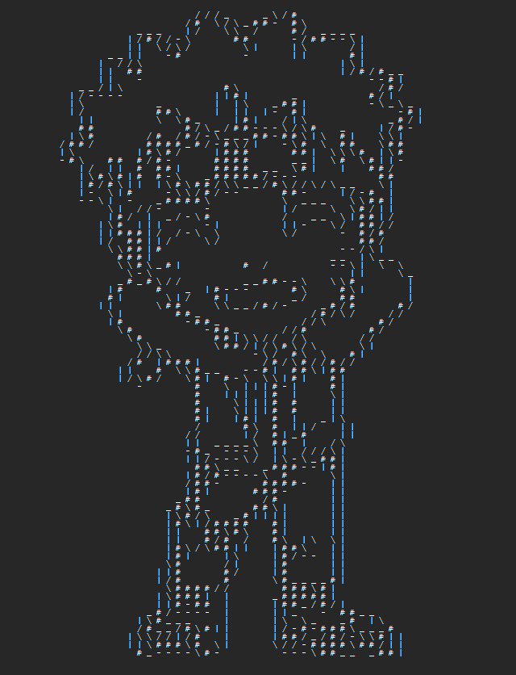

# ASCII ART

## THIS DOCUMENTATION IS OUTDATED, WILL UPDATE IT ONCE I SETTLE ON A GOOD UI

This project attempts to draw images on *txt* files also known as ASCII art.

---

## Requirements
1. [python3](https://www.python.org/downloads/)
2. cv2
   ```bash
   pip install opencv-python
   ```
---
## How to use?
1. put your images inside inputs directory
   Example:<br>
   <br>
   
2. run main.py
   ```bash
   python main.py
   ```
3. open outputs directory to see your images to texts<br>
   <br>
   


>**NOTE:** you might need to play with **TEXT_WIDTH** and **CANNY_CONSTANT** variables inside main.py if you don't get your desired output.

>**IMAGE:** Images with less details and sharper edges works the best

---
## About some variables in main.py
1. ### TEXT_WIDTH 
   > This value represents the number of characters/2 per line. Example: if TEXT_WIDTH = 10, the row width will be 20 characters long, [ did this for proper scaling because, in monofonts width of character is usually half of its height ].
   The higher the value more the data will be preserved.

2. ### CANNY_CONSTANT
   > This value is used to suppress weak edges that may be caused by noise in the image. Any edges that have a gradient magnitude below this threshold will not be included in the output of the function.
   If your image is noisy, increase this value. However, increasing this too much can lead to dataloss.

---
HAVE A NICE DAY :P
```
                  _ _ _ _ _                                 _     _            
              / -           \ _                           /   \ #   \   _      
          _ /                   \                       | \   | #     #   \    
          |     _           _     \                       #     # |   #   |    
        /   | \ _ \     | \ _ \     \                     | #     \   \   |    
      |     # /   \ |   # /   \ |   |                       \ \           |    
      |                                                   / -             |    
      |     _ _ _ _ _ _ _ _ _ _       |                 /                 |    
      |     # \ _ _ _ _ _ _ _ / |     |               |       / - \       |    
      |     |                 |     |                 |     /       |     |    
        |     \               /     /                   / \         |     |    
        \       \           /       |                 |     \     /       /    
          \       - - - - -       /                     |     - -         |    
            \                   /                       \ _             /      
              - \ _ _   _ _ / -                             \ _ _ _ / -        
                      -
```